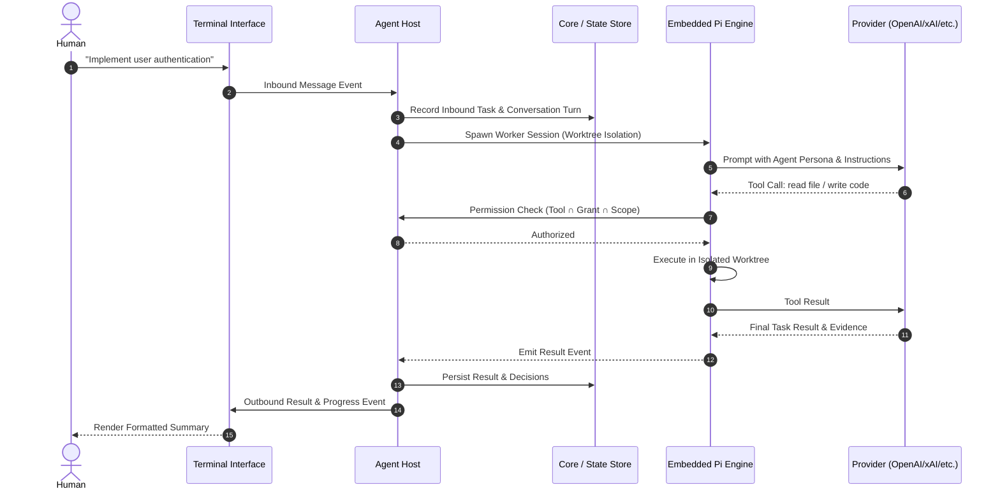

# Architecture Overview

This document describes the runtime architecture, subsystem boundaries, and lifecycle execution model of **VibeKit Agents**.

---

## High-Level Architecture

VibeKit operates as an always-running Host that bridges human communication interfaces with autonomous agent execution:

```text
                          Human Operator
                                │
          ┌─────────────────────┴─────────────────────┐
          ▼                                           ▼
   vibekit CLI (`msg`)                       Terminal Interface
   @useagentsio/cli                   @useagentsio/interface-terminal
          │                                           │
          └─────────────────────┬─────────────────────┘
                                ▼
                         AGENT HOST
                      @useagentsio/host
                   (Always-Running Daemon)
                                │
        ┌───────────────────────┼───────────────────────┐
        ▼                       ▼                       ▼
   PROJECT CONTRACT       STATE BACKEND           EMBEDDED PI
   @useagentsio/core    @useagentsio/core      @useagentsio/pi
  - project.yaml       - .vibekit/state/      - Session Factory
  - installed.json     - Tasks & Results      - Tool Binding
  - Agent Recipes      - Conversations        - Worktree Isolation
  - Boundary Policies  - Decisions/Approvals  - Worker Runs
```

---

## Core Subsystems

### 1. The Agent Host (`@useagentsio/host`)
The Host is the central process manager. It performs the following roles:
- **Project Loader**: Loads `.vibekit/project.yaml` and `installed.json` on startup.
- **Interface Manager**: Initializes configured Interfaces (`interface:terminal` plus any optional bindings), binds inbound/outbound event channels, and monitors connection health.
- **Turn Runner**: Ingests inbound user messages, resolves agent bindings, verifies permission limits, and schedules execution.
- **Session Manager**: Manages persistent conversation sessions across turns and spins up isolated worker sessions for task execution.
- **State Coordinator**: Atomically writes turn state, task results, approvals, and events to the repository state backend.
- **Graceful Shutdown**: Intercepts process signals (`SIGINT`, `SIGTERM`), halts active worker runs cleanly, releases worktree locks, and closes interfaces.

### 2. Embedded Pi Adapter (`@useagentsio/pi`)
Pi is the internal execution engine that translates agent directives into LLM API calls and tool invocations:
- **Isolation Layers**: Supports process isolation and Git worktree isolation for mutation tasks.
- **Tool Adapter**: Binds Pi built-in tools (`read`, `grep`, `find`, `ls`, `write`, `edit`, `bash`) under strict host-enforced capability rules.
- **Delegation Runtime**: Implements `agent_delegate` tool enabling parent agents to dispatch child tasks with bounded context and explicit depth limits.
- **Event Streaming**: Streams fine-grained execution events (token deltas, tool calls, tool results) back to the Host.

### 3. Core Engine (`@useagentsio/core`)
The foundation library for contracts and State:
- **JSON Schema Validation**: Validates all project contracts, agent definitions, component manifests, and state records against draft-07 schemas.
- **Typed IDs**: Strongly-typed parsers and stringifiers for module IDs (`agent:coder`, `tool:filesystem`), task IDs (`task_*`), and run IDs (`run_*`).
- **Dependency Graph**: Resolves transitive module dependencies, detects dependency cycles, and verifies compatibility.
- **Three-Way Engine**: Performs three-way diffing and non-destructive updates between base registry versions, local project files, and upstream releases.
- **State Repository**: Local file-system implementation of state storage.

### 4. Interface SDK (`@useagentsio/interface-sdk`)
A decoupled contract defining the bidirectional interface protocol:
- **Inbound Events**: `message`, `cancel`, `approval`, `disconnect`.
- **Outbound Events**: `progress`, `result`, `ask-approval`, `error`, `idle`.

---

## Execution Lifecycle

A typical execution flow unfolds as follows:



1. **Inbound Ingestion**: The Interface captures user input and sends a structured `InboundMessage` to the Host.
2. **Context Resolution**: The Host loads the default or targeted Agent binding, checks delegation depth, and prepares the turn context.
3. **Execution Isolation**: For mutating tasks, the Host creates a temporary Git worktree branch so uncommitted changes do not corrupt the working tree.
4. **Tool Enforcement**: Tool invocations pass through the Host's runtime permission gate. Unauthorized file writes or commands outside granted paths are rejected.
5. **Result & Persistence**: Pi returns a structured `ResultDocument` with artifacts and evidence. The Host commits the state record and notifies the Interface.
6. **Cleanup**: Ephemeral worktree environments and session handles are torn down.
